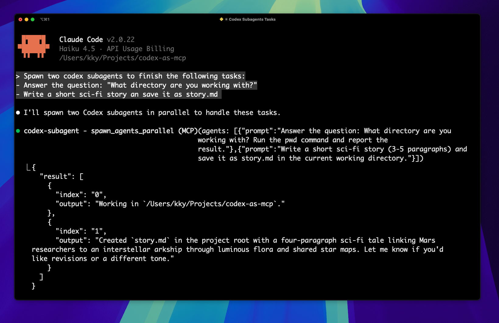
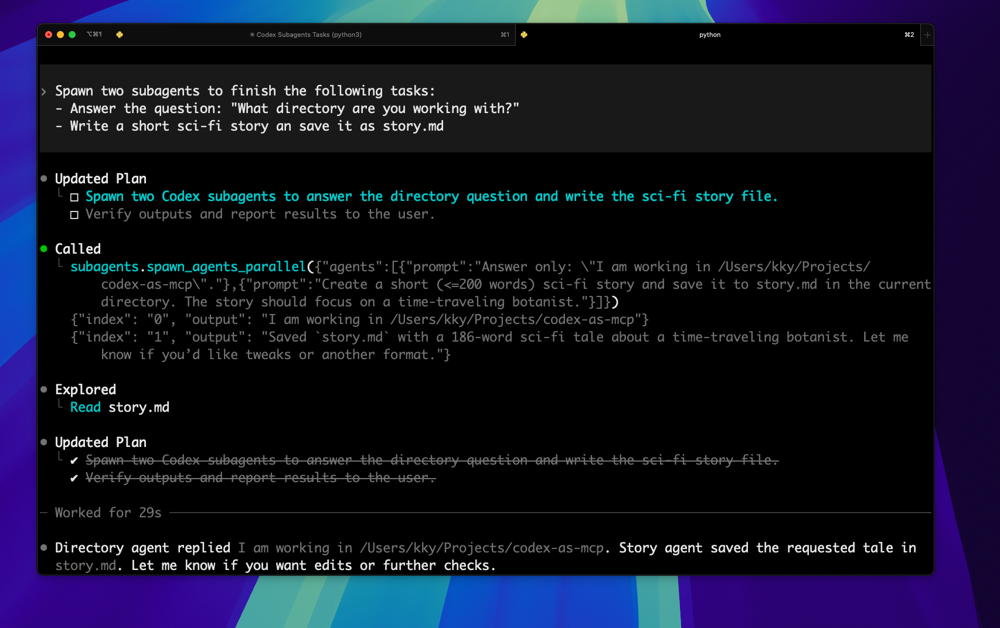

# codex-as-mcp

Minimal MCP server that lets you spawn Codex agents from any MCP client. Seven tools are exposed:
- `spawn_agent` (blocking) - Runs a single Codex agent and waits for completion
- `spawn_agent_async` (non-blocking) - Starts an agent in the background, returns immediately
- `get_agent_status` - Check status of async agents
- `list_agent_tasks` - List all running/completed async tasks
- `spawn_agents_parallel` - Launches multiple Codex agents concurrently
- `list_agent_logs` - List recent agent log files with size and timestamps
- `cleanup_old_logs` - Delete old log files to free up space

[中文版](./README.zh-CN.md)

**Use it in Claude Code**

There are two tools in codex-as-mcp


You can spawn parallel codex subagents using prompt.


Here's a sample Codex session delegating two tasks in parallel.


## Setup

### 1. Install Codex CLI

**Requires Codex CLI >= 0.46.0**

```bash
npm install -g @openai/codex@latest
codex login

# Verify installation
codex --version
```

### 2. Configure MCP

Add to your `.mcp.json`:
```json
{
  "mcpServers": {
    "codex-subagent": {
      "type": "stdio",
      "command": "uvx",
      "args": ["codex-as-mcp@latest"]
    }
  }
}
```

Or use Claude Desktop commands:
```bash
claude mcp add codex-subagent -- uvx codex-as-mcp@latest
```

If you're configuring Codex CLI directly (for example `~/.config/codex/config.toml`), add:
```toml
[mcp_servers.subagents]
command = "uvx"
args = ["codex-as-mcp@latest"]
```

## ⚠️ Important: Claude Desktop Limitation

**Claude Desktop has a fixed 60-second timeout** for MCP tool calls that cannot be configured and does not reset on progress updates.

### ✅ Solution: Use Async Tools

For Claude Desktop users, use the **async workflow** to avoid timeout issues:

```python
# 1. Start agent (returns immediately, no timeout)
result = spawn_agent_async("Long-running task...")

# 2. Check status (as needed)
status = get_agent_status(result["task_id"])

# 3. When complete, retrieve output
if status["status"] == "completed":
    print(status["output"])
```

**Benefits:**
- ✅ No 60-second timeout (each call returns in <1 second)
- ✅ Agent runs autonomously in background
- ✅ Monitor progress via log files
- ✅ Check status as frequently as needed

**For Claude Code CLI users:**
- ✅ Can use either `spawn_agent` (blocking) or `spawn_agent_async`
- ✅ No timeout limitations

See [CLAUDE.md](./CLAUDE.md) for detailed documentation.

## Tools

### Blocking (for Claude Code CLI)

- **`spawn_agent(prompt, reasoning_effort?, model?)`** – Spawns an autonomous Codex agent and waits for completion. **Not recommended for Claude Desktop** (60s timeout). Returns the agent's final message and log file path.

### Non-blocking (✅ for Claude Desktop)

- **`spawn_agent_async(prompt, reasoning_effort?, model?)`** – Starts a Codex agent in the background and returns immediately with a task ID. **Recommended for Claude Desktop** to avoid timeout issues.

- **`get_agent_status(task_id)`** – Check the status of an async agent. Returns `"running"`, `"completed"`, or `"failed"` with output/error details.

- **`list_agent_tasks()`** – List all tracked agent tasks (running and completed).

### Parallel Execution

- **`spawn_agents_parallel(agents, max_parallel?)`** – Runs multiple Codex agents concurrently. Each agent spec includes `prompt` and optional `reasoning_effort`, `model`. Returns results for all agents.

**Parameters:**
- `reasoning_effort`: `"low"` (fast), `"medium"` (default), `"high"` (complex), `"xhigh"` (very complex)
- `model`: Override Codex model (e.g., `"gpt-5.2-codex"`, `"gpt-5.1-codex-mini"`)

**Logs**: All agent activity is logged to `~/.cache/codex-as-mcp/logs/` in a human-readable format. Monitor live with:
```bash
tail -f ~/.cache/codex-as-mcp/logs/codex_agent_*.log
```

## Examples

### Basic Usage (Default Model)

```python
# Simple task with default settings (gpt-5.2-codex, medium reasoning)
spawn_agent("Analyze the codebase and create a summary in SUMMARY.md")
```

### Using Different Models

```python
# Fast, cost-effective model for simple tasks
spawn_agent(
    "Fix typos in README.md",
    model="gpt-5.1-codex-mini",
    reasoning_effort="low"
)

# Most advanced model for complex analysis
spawn_agent(
    "Refactor authentication system with proper error handling",
    model="gpt-5.2-codex",
    reasoning_effort="high"
)

# Balanced model for most tasks
spawn_agent(
    "Add unit tests for user service",
    model="gpt-5.1-codex-max",
    reasoning_effort="medium"
)
```

### Async Workflow (Claude Desktop)

```python
# Start complex task in background
result = spawn_agent_async(
    "Analyze all API endpoints and generate OpenAPI spec",
    model="gpt-5.2-codex",
    reasoning_effort="high"
)

# Get task ID
task_id = result["task_id"]
log_file = result["log_file"]

# Monitor progress (optional)
# You can read the log file to see what the agent is doing
read_file(log_file)

# Check status periodically (wait at least 30 seconds between checks)
status = get_agent_status(task_id)

# When complete, get output
if status["status"] == "completed":
    print(status["output"])
```

### Parallel Execution

```python
# Run multiple agents concurrently
agents = [
    {
        "prompt": "Update all dependencies in package.json",
        "model": "gpt-5.1-codex-mini",
        "reasoning_effort": "low"
    },
    {
        "prompt": "Analyze security vulnerabilities in authentication code",
        "model": "gpt-5.2-codex",
        "reasoning_effort": "high"
    },
    {
        "prompt": "Generate API documentation from code comments",
        "model": "gpt-5.1-codex-max",
        "reasoning_effort": "medium"
    }
]

# Run all agents (max 2 at a time)
results = spawn_agents_parallel(agents, max_parallel=2)

# Check results
for result in results:
    if "output" in result:
        print(f"Agent {result['index']}: {result['output']}")
    else:
        print(f"Agent {result['index']} failed: {result['error']}")
```

### Available Models

| Model | Best For | Cost | Speed |
|-------|----------|------|-------|
| `gpt-5.2-codex` | Complex tasks, long-horizon work, large code changes | Higher | Slower |
| `gpt-5.1-codex-max` | Balanced performance, agentic tasks | Medium | Medium |
| `gpt-5.1-codex-mini` | Simple tasks, quick fixes, cost-sensitive work | Lower (~4x more usage) | Faster |
| `gpt-5.2` | General purpose (Windows default) | Medium | Medium |
| `gpt-5-codex` | macOS/Linux default | Medium | Medium |

**Note:** Models like `o3-mini`, `o1-preview`, or `codex-1` are **NOT** supported in Codex CLI. Always use the `gpt-5.x-codex` variants.

### Log Management

```python
# List recent log files
logs = list_agent_logs(max_count=10)
print(f"Total logs: {logs['total']}")
for log in logs['logs']:
    print(f"{log['path']} - {log['size_human']} - {log['modified']}")

# Clean up old logs (dry run first)
result = cleanup_old_logs(days=7, dry_run=True)
print(f"Would delete {result['deleted_count']} files, freeing {result['freed_human']}")

# Actually delete old logs
result = cleanup_old_logs(days=7, dry_run=False)
print(f"Deleted {result['deleted_count']} files, freed {result['freed_human']}")
```

## Configuration

### Environment variables

- `CODEX_AGENT_CWD`: Overrides the working directory passed to spawned agents (`--cd`). By default agents inherit the MCP server's current directory (`os.getcwd()`); set this when the server must run from one location but agents should edit a different workspace (for example, the server runs from a parent folder while agents work inside a repo).
- `CODEX_AS_MCP_LOG_DIR`: Overrides where stdout/stderr logs are persisted (default `~/.cache/codex-as-mcp/logs`). Use the `Log file:` line in tool responses to inspect saved output.

Example `.mcp.json` showing a custom agent working directory:

```json
{
  "mcpServers": {
    "codex-subagent": {
      "type": "stdio",
      "command": "uvx",
      "args": ["codex-as-mcp@latest"],
      "env": {
        "CODEX_AGENT_CWD": "/Users/you/projects/target-repo"
      }
    }
  }
}
```

## Run from a cloned repository

If you want to run the MCP server directly from a local checkout without installing the published package, use:

```bash
uv run python -m codex_as_mcp
```

This uses `uv` to resolve and install dependencies declared in `pyproject.toml` into an isolated environment. If you've already installed the dependencies into your active environment, you can invoke the module directly:

```bash
python -m codex_as_mcp
```

To point a `.mcp.json` configuration at your cloned source (using `uv` to handle dependencies), add:

```json
{
  "mcpServers": {
    "codex-subagent": {
      "type": "stdio",
      "command": "uv",
      "args": ["run", "python", "-m", "codex_as_mcp"]
    }
  }
}
```
