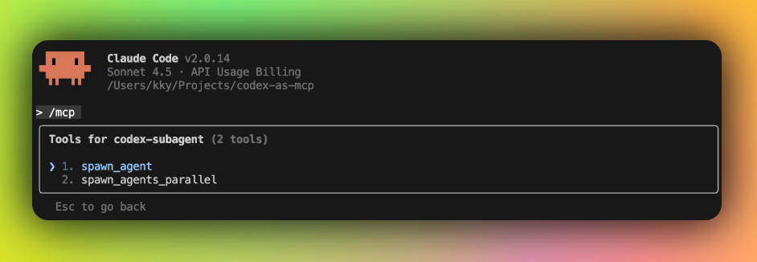
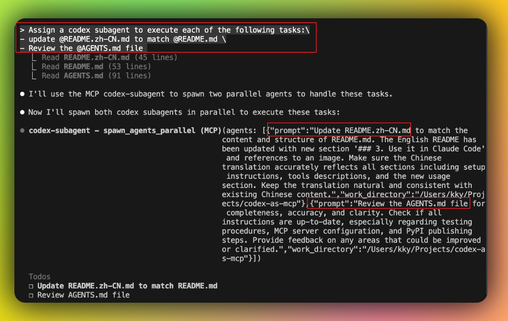

# codex-as-mcp

[中文版](./README.zh-CN.md)

**Spawn multiple subagents via Codex-as-MCP**

Each subagent runs `codex e --full-auto` with complete autonomy in a specified directory. Perfect for Plus/Pro/Team subscribers leveraging GPT-5 capabilities.

**Use it in Claude Code**

There are two tools in codex-as-mcp


You can spawn parallel codex subagents using prompt.


## Setup

### 1. Install Codex CLI

**Requires Codex CLI >= 0.46.0**

```bash
npm install -g @openai/codex@latest
codex login

# Verify installation
codex --version
```

### 2. Configure MCP

Add to your `.mcp.json`:
```json
{
  "mcpServers": {
    "codex-subagent": {
      "type": "stdio",
      "command": "uvx",
      "args": ["codex-as-mcp@latest"]
    }
  }
}
```

Or use Claude Desktop commands:
```bash
claude mcp add codex-subagent -- uvx codex-as-mcp@latest
```

## Tools

- `spawn_agent(prompt, work_directory)` - Spawns an autonomous Codex subagent in the specified directory
- `spawn_agents_parallel(agents)` - Spawns multiple Codex subagents in parallel. Takes a list of agent specs with `prompt` and `work_directory` fields